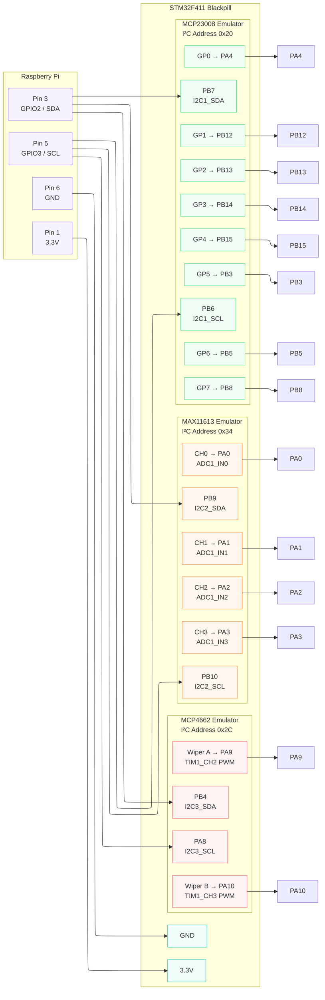

## Raspberry Pi ↔ STM32F411 Blackpill Connections

```mermaid
%%{init: {"flowchart": {"defaultRenderer": "elk"}}}%%
flowchart LR

    classDef purple stroke:#a78bfa,fill:#f5f3ff;
    classDef green stroke:#4ade80,fill:#f0fdf4;
    classDef orange stroke:#fb923c,fill:#fff7ed;
    classDef red stroke:#f87171,fill:#fef2f2;
    classDef teal stroke:#2dd4bf,fill:#f0fdfa;

    %% Raspberry Pi
    subgraph R["Raspberry Pi"]
    direction TB
        P1["Pin 1<br/>3.3V"]:::purple
        P3["Pin 3<br/>GPIO2 / SDA"]:::purple
        P5["Pin 5<br/>GPIO3 / SCL"]:::purple
        P6["Pin 6<br/>GND"]:::purple
    end

    %% STM32F411 Blackpill
    subgraph B["STM32F411 Blackpill"]
    direction TB

        VCC["3.3V"]:::teal
        GND["GND"]:::teal

        %% MCP23008
        subgraph MCP["MCP23008 Emulator<br/>I²C Address 0x20"]
        direction TB

            MCP_SDA["PB7<br/>I2C1_SDA"]:::green
            MCP_SCL["PB6<br/>I2C1_SCL"]:::green

            GP0["GP0 → PA4"]:::green
            GP1["GP1 → PB12"]:::green
            GP2["GP2 → PB13"]:::green
            GP3["GP3 → PB14"]:::green
            GP4["GP4 → PB15"]:::green
            GP5["GP5 → PB3"]:::green
            GP6["GP6 → PB5"]:::green
            GP7["GP7 → PB8"]:::green
        end

        %% MAX11613
        subgraph MAX["MAX11613 Emulator<br/>I²C Address 0x34"]
        direction TB

            MAX_SDA["PB9<br/>I2C2_SDA"]:::orange
            MAX_SCL["PB10<br/>I2C2_SCL"]:::orange

            CH0["CH0 → PA0<br/>ADC1_IN0"]:::orange
            CH1["CH1 → PA1<br/>ADC1_IN1"]:::orange
            CH2["CH2 → PA2<br/>ADC1_IN2"]:::orange
            CH3["CH3 → PA3<br/>ADC1_IN3"]:::orange
        end

        %% MCP4662
        subgraph POT["MCP4662 Emulator<br/>I²C Address 0x2C"]
        direction TB

            POT_SDA["PB4<br/>I2C3_SDA"]:::red
            POT_SCL["PA8<br/>I2C3_SCL"]:::red

            WA["Wiper A → PA9<br/>TIM1_CH2 PWM"]:::red
            WB["Wiper B → PA10<br/>TIM1_CH3 PWM"]:::red
        end
    end

    %% Power
    P1 --> VCC
    P6 --> GND

    %% SDA
    P3 --> MCP_SDA
    P3 --> MAX_SDA
    P3 --> POT_SDA

    %% SCL
    P5 --> MCP_SCL
    P5 --> MAX_SCL
    P5 --> POT_SCL

    %% MCP23008 Outputs
    GP0 --> GP0_OUT["PA4"]
    GP1 --> GP1_OUT["PB12"]
    GP2 --> GP2_OUT["PB13"]
    GP3 --> GP3_OUT["PB14"]
    GP4 --> GP4_OUT["PB15"]
    GP5 --> GP5_OUT["PB3"]
    GP6 --> GP6_OUT["PB5"]
    GP7 --> GP7_OUT["PB8"]

    %% MAX11613 Inputs
    CH0 --> CH0_OUT["PA0"]
    CH1 --> CH1_OUT["PA1"]
    CH2 --> CH2_OUT["PA2"]
    CH3 --> CH3_OUT["PA3"]

    %% MCP4662 Outputs
    WA --> WA_OUT["PA9"]
    WB --> WB_OUT["PA10"]
```
