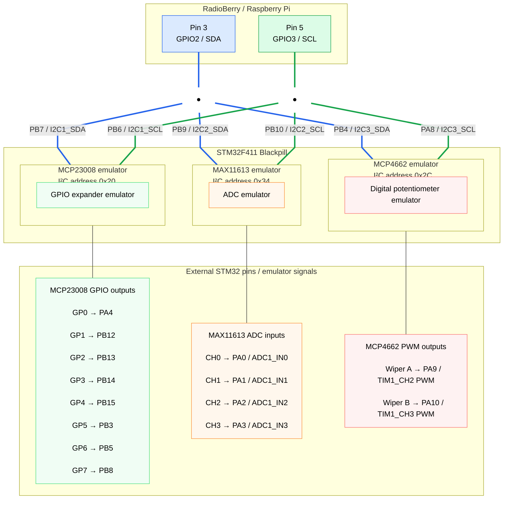

```mermaid
%%{init: {"flowchart": {"curve": "linear"}}}%%
flowchart TB

    classDef rpi stroke:#60a5fa,fill:#eff6ff,color:#000;
    classDef bp stroke:#9ca3af,fill:#f9fafb,color:#000;
    classDef mcp stroke:#4ade80,fill:#f0fdf4,color:#000;
    classDef max stroke:#fb923c,fill:#fff7ed,color:#000;
    classDef pot stroke:#f87171,fill:#fef2f2,color:#000;
    classDef sda stroke:#2563eb,fill:#dbeafe,color:#000;
    classDef scl stroke:#16a34a,fill:#dcfce7,color:#000;
    classDef dot stroke:transparent,fill:transparent,color:#000;

    %% =====================================================
    %% RADIOBERRY / RASPBERRY PI
    %% =====================================================

    subgraph RB["RadioBerry / Raspberry Pi"]
    direction LR
        RPI_SDA["Pin 3<br/>GPIO2 / SDA"]:::sda
        RPI_SCL["Pin 5<br/>GPIO3 / SCL"]:::scl
    end

    %% =====================================================
    %% I2C BUS SPLIT POINTS
    %% =====================================================

    SDA_DOT["●"]:::dot
    SCL_DOT["●"]:::dot

    RPI_SDA --- SDA_DOT
    RPI_SCL --- SCL_DOT

    %% =====================================================
    %% STM32F411 BLACKPILL
    %% =====================================================

    subgraph BP["STM32F411 Blackpill"]
    direction LR

        subgraph MCP["MCP23008 emulator<br/>I²C address 0x20"]
        direction TB
            MCP_TEXT["GPIO expander emulator"]:::mcp
        end

        subgraph MAX["MAX11613 emulator<br/>I²C address 0x34"]
        direction TB
            MAX_TEXT["ADC emulator"]:::max
        end

        subgraph POT["MCP4662 emulator<br/>I²C address 0x2C"]
        direction TB
            POT_TEXT["Digital potentiometer emulator"]:::pot
        end
    end

    %% =====================================================
    %% I2C CONNECTIONS
    %% =====================================================

    SDA_DOT ---|"PB7 / I2C1_SDA"| MCP
    SDA_DOT ---|"PB9 / I2C2_SDA"| MAX
    SDA_DOT ---|"PB4 / I2C3_SDA"| POT

    SCL_DOT ---|"PB6 / I2C1_SCL"| MCP
    SCL_DOT ---|"PB10 / I2C2_SCL"| MAX
    SCL_DOT ---|"PA8 / I2C3_SCL"| POT

    %% =====================================================
    %% EMULATOR OUTPUTS
    %% =====================================================

    subgraph OUT["External STM32 pins / emulator signals"]
    direction LR

        MCP_OUT["MCP23008 GPIO outputs<br/>
        GP0 → PA4<br/>
        GP1 → PB12<br/>
        GP2 → PB13<br/>
        GP3 → PB14<br/>
        GP4 → PB15<br/>
        GP5 → PB3<br/>
        GP6 → PB5<br/>
        GP7 → PB8"]:::mcp

        MAX_OUT["MAX11613 ADC inputs<br/>
        CH0 → PA0 / ADC1_IN0<br/>
        CH1 → PA1 / ADC1_IN1<br/>
        CH2 → PA2 / ADC1_IN2<br/>
        CH3 → PA3 / ADC1_IN3"]:::max

        POT_OUT["MCP4662 PWM outputs<br/>
        Wiper A → PA9 / TIM1_CH2 PWM<br/>
        Wiper B → PA10 / TIM1_CH3 PWM"]:::pot
    end

    MCP --- MCP_OUT
    MAX --- MAX_OUT
    POT --- POT_OUT

    %% =====================================================
    %% LINE COLORS
    %% =====================================================

    linkStyle 0 stroke:#2563eb,stroke-width:3px;
    linkStyle 1 stroke:#16a34a,stroke-width:3px;

    linkStyle 2 stroke:#2563eb,stroke-width:3px;
    linkStyle 3 stroke:#2563eb,stroke-width:3px;
    linkStyle 4 stroke:#2563eb,stroke-width:3px;

    linkStyle 5 stroke:#16a34a,stroke-width:3px;
    linkStyle 6 stroke:#16a34a,stroke-width:3px;
    linkStyle 7 stroke:#16a34a,stroke-width:3px;
```
