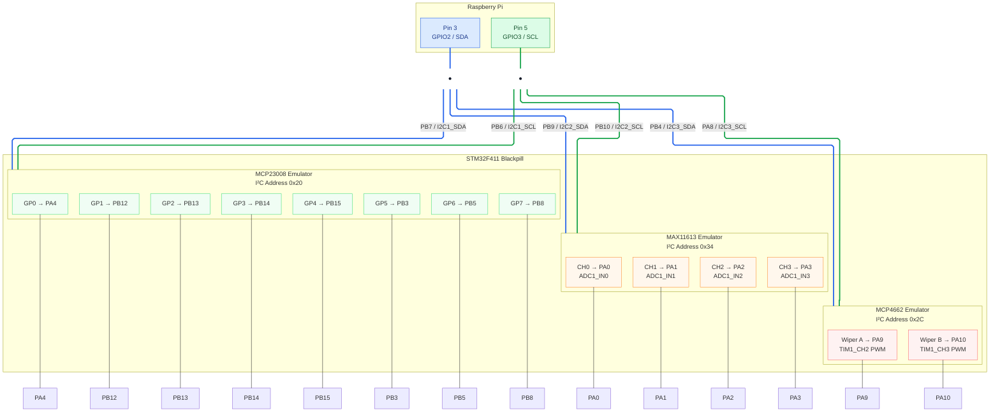

```mermaid
%%{init: {"flowchart": {"defaultRenderer": "elk", "curve": "linear"}}}%%
flowchart TB

    classDef purple stroke:#a78bfa,fill:#f5f3ff;
    classDef green stroke:#4ade80,fill:#f0fdf4;
    classDef orange stroke:#fb923c,fill:#fff7ed;
    classDef red stroke:#f87171,fill:#fef2f2;
    classDef sda stroke:#2563eb,fill:#dbeafe,color:#1e3a8a;
    classDef scl stroke:#16a34a,fill:#dcfce7,color:#14532d;
    classDef dot stroke:transparent,fill:transparent,color:#111827;
    classDef hidden stroke:transparent,fill:transparent,color:transparent;

    %% Raspberry Pi block - top
    subgraph R["Raspberry Pi"]
    direction LR
        P3["Pin 3<br/>GPIO2 / SDA"]:::sda
        P5["Pin 5<br/>GPIO3 / SCL"]:::scl
    end

    %% Bus split points
    SDA_DOT["●"]:::dot
    SCL_DOT["●"]:::dot

    %% STM32F411 Blackpill block - bottom
    subgraph B["STM32F411 Blackpill"]
    direction LR

        %% MCP23008
        subgraph MCP["MCP23008 Emulator<br/>I²C Address 0x20"]
        direction TB
            GP0["GP0 → PA4"]:::green
            GP1["GP1 → PB12"]:::green
            GP2["GP2 → PB13"]:::green
            GP3["GP3 → PB14"]:::green
            GP4["GP4 → PB15"]:::green
            GP5["GP5 → PB3"]:::green
            GP6["GP6 → PB5"]:::green
            GP7["GP7 → PB8"]:::green
        end

        %% MAX11613
        subgraph MAX["MAX11613 Emulator<br/>I²C Address 0x34"]
        direction TB
            CH0["CH0 → PA0<br/>ADC1_IN0"]:::orange
            CH1["CH1 → PA1<br/>ADC1_IN1"]:::orange
            CH2["CH2 → PA2<br/>ADC1_IN2"]:::orange
            CH3["CH3 → PA3<br/>ADC1_IN3"]:::orange
        end

        %% MCP4662
        subgraph POT["MCP4662 Emulator<br/>I²C Address 0x2C"]
        direction TB
            WA["Wiper A → PA9<br/>TIM1_CH2 PWM"]:::red
            WB["Wiper B → PA10<br/>TIM1_CH3 PWM"]:::red
        end
    end

    %% SDA bus
    P3 --- SDA_DOT
    SDA_DOT ---|"PB7 / I2C1_SDA"| MCP
    SDA_DOT ---|"PB9 / I2C2_SDA"| MAX
    SDA_DOT ---|"PB4 / I2C3_SDA"| POT

    %% SCL bus
    P5 --- SCL_DOT
    SCL_DOT ---|"PB6 / I2C1_SCL"| MCP
    SCL_DOT ---|"PB10 / I2C2_SCL"| MAX
    SCL_DOT ---|"PA8 / I2C3_SCL"| POT

    %% Force horizontal order of subblocks inside Blackpill
    MCP ~~~ MAX
    MAX ~~~ POT

    %% MCP23008 outputs
    GP0 --- GP0_OUT["PA4"]
    GP1 --- GP1_OUT["PB12"]
    GP2 --- GP2_OUT["PB13"]
    GP3 --- GP3_OUT["PB14"]
    GP4 --- GP4_OUT["PB15"]
    GP5 --- GP5_OUT["PB3"]
    GP6 --- GP6_OUT["PB5"]
    GP7 --- GP7_OUT["PB8"]

    %% MAX11613 analog inputs
    CH0 --- CH0_OUT["PA0"]
    CH1 --- CH1_OUT["PA1"]
    CH2 --- CH2_OUT["PA2"]
    CH3 --- CH3_OUT["PA3"]

    %% MCP4662 PWM outputs
    WA --- WA_OUT["PA9"]
    WB --- WB_OUT["PA10"]

    %% SDA line color
    linkStyle 0 stroke:#2563eb,stroke-width:3px;
    linkStyle 1 stroke:#2563eb,stroke-width:3px;
    linkStyle 2 stroke:#2563eb,stroke-width:3px;
    linkStyle 3 stroke:#2563eb,stroke-width:3px;

    %% SCL line color
    linkStyle 4 stroke:#16a34a,stroke-width:3px;
    linkStyle 5 stroke:#16a34a,stroke-width:3px;
    linkStyle 6 stroke:#16a34a,stroke-width:3px;
    linkStyle 7 stroke:#16a34a,stroke-width:3px;
```
