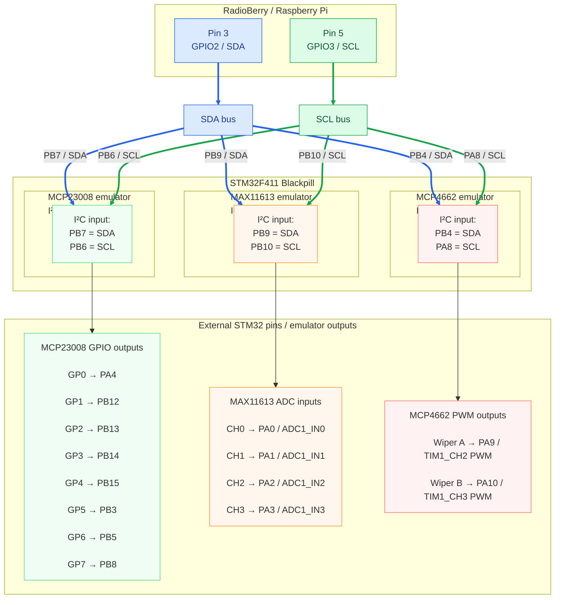

```mermaid
flowchart TB

    classDef rpi stroke:#60a5fa,fill:#eff6ff;
    classDef blackpill stroke:#9ca3af,fill:#f9fafb;
    classDef mcp stroke:#4ade80,fill:#f0fdf4;
    classDef max stroke:#fb923c,fill:#fff7ed;
    classDef pot stroke:#f87171,fill:#fef2f2;
    classDef sda stroke:#2563eb,fill:#dbeafe,color:#1e3a8a;
    classDef scl stroke:#16a34a,fill:#dcfce7,color:#14532d;
    classDef bus stroke:#111827,fill:#ffffff;

    %% =====================================================
    %% RADIOBERRY / RASPBERRY PI
    %% =====================================================

    subgraph RB["RadioBerry / Raspberry Pi"]
    direction TB
        RPI_SDA["Pin 3<br/>GPIO2 / SDA"]:::sda
        RPI_SCL["Pin 5<br/>GPIO3 / SCL"]:::scl
    end

    %% =====================================================
    %% SIMPLE I2C BUS
    %% =====================================================

    SDA_BUS["SDA bus"]:::sda
    SCL_BUS["SCL bus"]:::scl

    RPI_SDA --> SDA_BUS
    RPI_SCL --> SCL_BUS

    %% =====================================================
    %% BLACKPILL
    %% =====================================================

    subgraph BP["STM32F411 Blackpill"]
    direction TB

        subgraph MCP["MCP23008 emulator<br/>I²C address 0x20"]
        direction TB
            MCP_IN["I²C input:<br/>PB7 = SDA<br/>PB6 = SCL"]:::mcp
        end

        subgraph MAX["MAX11613 emulator<br/>I²C address 0x34"]
        direction TB
            MAX_IN["I²C input:<br/>PB9 = SDA<br/>PB10 = SCL"]:::max
        end

        subgraph POT["MCP4662 emulator<br/>I²C address 0x2C"]
        direction TB
            POT_IN["I²C input:<br/>PB4 = SDA<br/>PA8 = SCL"]:::pot
        end
    end

    %% =====================================================
    %% STRAIGHT I2C CONNECTIONS
    %% =====================================================

    SDA_BUS -->|"PB7 / SDA"| MCP_IN
    SCL_BUS -->|"PB6 / SCL"| MCP_IN

    SDA_BUS -->|"PB9 / SDA"| MAX_IN
    SCL_BUS -->|"PB10 / SCL"| MAX_IN

    SDA_BUS -->|"PB4 / SDA"| POT_IN
    SCL_BUS -->|"PA8 / SCL"| POT_IN

    %% =====================================================
    %% EMULATOR OUTPUTS
    %% =====================================================

    subgraph OUT["External STM32 pins / emulator outputs"]
    direction TB

        MCP_OUT["MCP23008 GPIO outputs<br/>
        GP0 → PA4<br/>
        GP1 → PB12<br/>
        GP2 → PB13<br/>
        GP3 → PB14<br/>
        GP4 → PB15<br/>
        GP5 → PB3<br/>
        GP6 → PB5<br/>
        GP7 → PB8"]:::mcp

        MAX_OUT["MAX11613 ADC inputs<br/>
        CH0 → PA0 / ADC1_IN0<br/>
        CH1 → PA1 / ADC1_IN1<br/>
        CH2 → PA2 / ADC1_IN2<br/>
        CH3 → PA3 / ADC1_IN3"]:::max

        POT_OUT["MCP4662 PWM outputs<br/>
        Wiper A → PA9 / TIM1_CH2 PWM<br/>
        Wiper B → PA10 / TIM1_CH3 PWM"]:::pot
    end

    MCP_IN --> MCP_OUT
    MAX_IN --> MAX_OUT
    POT_IN --> POT_OUT

    %% =====================================================
    %% LINE COLORS
    %% =====================================================

    linkStyle 0 stroke:#2563eb,stroke-width:3px;
    linkStyle 1 stroke:#16a34a,stroke-width:3px;

    linkStyle 2 stroke:#2563eb,stroke-width:3px;
    linkStyle 4 stroke:#2563eb,stroke-width:3px;
    linkStyle 6 stroke:#2563eb,stroke-width:3px;

    linkStyle 3 stroke:#16a34a,stroke-width:3px;
    linkStyle 5 stroke:#16a34a,stroke-width:3px;
    linkStyle 7 stroke:#16a34a,stroke-width:3px;
```
