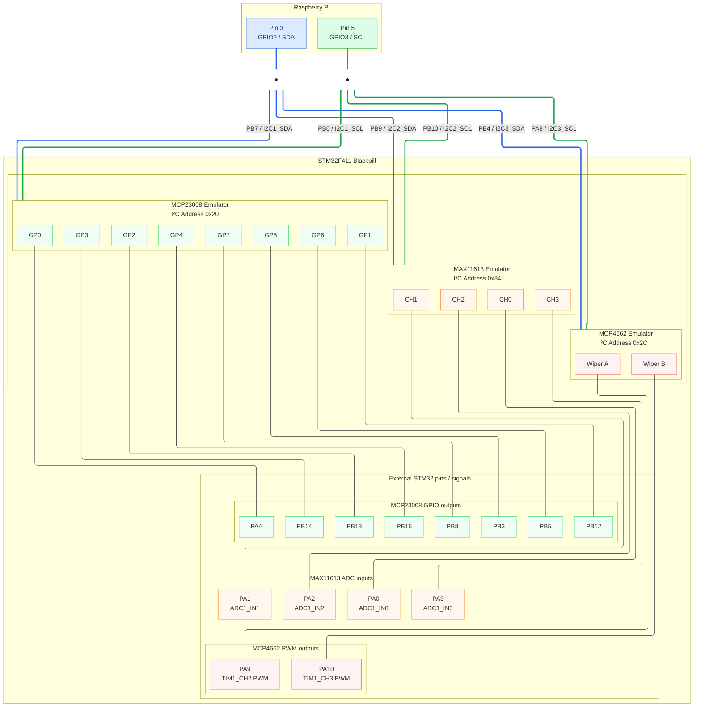

```mermaid
%%{init: {"flowchart": {"defaultRenderer": "elk", "curve": "linear"}}}%%
flowchart TB

    classDef purple stroke:#a78bfa,fill:#f5f3ff;
    classDef green stroke:#4ade80,fill:#f0fdf4;
    classDef orange stroke:#fb923c,fill:#fff7ed;
    classDef red stroke:#f87171,fill:#fef2f2;
    classDef sda stroke:#2563eb,fill:#dbeafe,color:#1e3a8a;
    classDef scl stroke:#16a34a,fill:#dcfce7,color:#14532d;
    classDef dot stroke:transparent,fill:transparent,color:#111827;
    classDef hidden stroke:transparent,fill:transparent,color:transparent;

    %% Raspberry Pi block
    subgraph R["Raspberry Pi"]
    direction LR
        P3["Pin 3<br/>GPIO2 / SDA"]:::sda
        P5["Pin 5<br/>GPIO3 / SCL"]:::scl
    end

    %% Bus split points
    SDA_DOT["●"]:::dot
    SCL_DOT["●"]:::dot

    %% STM32F411 Blackpill block
    subgraph B["STM32F411 Blackpill"]
    direction TB

        %% Emulator blocks row
        subgraph EMU_ROW[" "]
        direction LR

            subgraph MCP["MCP23008 Emulator<br/>I²C Address 0x20"]
            direction TB
                GP0["GP0"]:::green
                GP1["GP1"]:::green
                GP2["GP2"]:::green
                GP3["GP3"]:::green
                GP4["GP4"]:::green
                GP5["GP5"]:::green
                GP6["GP6"]:::green
                GP7["GP7"]:::green
            end

            subgraph MAX["MAX11613 Emulator<br/>I²C Address 0x34"]
            direction TB
                CH0["CH0"]:::orange
                CH1["CH1"]:::orange
                CH2["CH2"]:::orange
                CH3["CH3"]:::orange
            end

            subgraph POT["MCP4662 Emulator<br/>I²C Address 0x2C"]
            direction TB
                WA["Wiper A"]:::red
                WB["Wiper B"]:::red
            end
        end

        %% Output pins row
        subgraph OUT_ROW["External STM32 pins / signals"]
        direction LR

            subgraph MCP_OUT["MCP23008 GPIO outputs"]
            direction TB
                GP0_OUT["PA4"]:::green
                GP1_OUT["PB12"]:::green
                GP2_OUT["PB13"]:::green
                GP3_OUT["PB14"]:::green
                GP4_OUT["PB15"]:::green
                GP5_OUT["PB3"]:::green
                GP6_OUT["PB5"]:::green
                GP7_OUT["PB8"]:::green
            end

            subgraph MAX_OUT["MAX11613 ADC inputs"]
            direction TB
                CH0_OUT["PA0<br/>ADC1_IN0"]:::orange
                CH1_OUT["PA1<br/>ADC1_IN1"]:::orange
                CH2_OUT["PA2<br/>ADC1_IN2"]:::orange
                CH3_OUT["PA3<br/>ADC1_IN3"]:::orange
            end

            subgraph POT_OUT["MCP4662 PWM outputs"]
            direction TB
                WA_OUT["PA9<br/>TIM1_CH2 PWM"]:::red
                WB_OUT["PA10<br/>TIM1_CH3 PWM"]:::red
            end
        end
    end

    %% SDA bus
    P3 --- SDA_DOT
    SDA_DOT ---|"PB7 / I2C1_SDA"| MCP
    SDA_DOT ---|"PB9 / I2C2_SDA"| MAX
    SDA_DOT ---|"PB4 / I2C3_SDA"| POT

    %% SCL bus
    P5 --- SCL_DOT
    SCL_DOT ---|"PB6 / I2C1_SCL"| MCP
    SCL_DOT ---|"PB10 / I2C2_SCL"| MAX
    SCL_DOT ---|"PA8 / I2C3_SCL"| POT

    %% MCP23008 outputs below block
    GP0 --- GP0_OUT
    GP1 --- GP1_OUT
    GP2 --- GP2_OUT
    GP3 --- GP3_OUT
    GP4 --- GP4_OUT
    GP5 --- GP5_OUT
    GP6 --- GP6_OUT
    GP7 --- GP7_OUT

    %% MAX11613 analog inputs below block
    CH0 --- CH0_OUT
    CH1 --- CH1_OUT
    CH2 --- CH2_OUT
    CH3 --- CH3_OUT

    %% MCP4662 PWM outputs below block
    WA --- WA_OUT
    WB --- WB_OUT

    %% Force horizontal order
    MCP ~~~ MAX
    MAX ~~~ POT
    MCP_OUT ~~~ MAX_OUT
    MAX_OUT ~~~ POT_OUT

    %% SDA line color
    linkStyle 0 stroke:#2563eb,stroke-width:3px;
    linkStyle 1 stroke:#2563eb,stroke-width:3px;
    linkStyle 2 stroke:#2563eb,stroke-width:3px;
    linkStyle 3 stroke:#2563eb,stroke-width:3px;

    %% SCL line color
    linkStyle 4 stroke:#16a34a,stroke-width:3px;
    linkStyle 5 stroke:#16a34a,stroke-width:3px;
    linkStyle 6 stroke:#16a34a,stroke-width:3px;
    linkStyle 7 stroke:#16a34a,stroke-width:3px;
```
